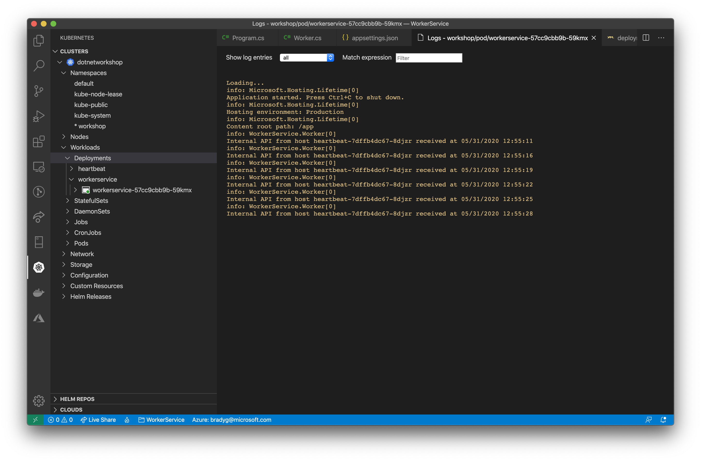
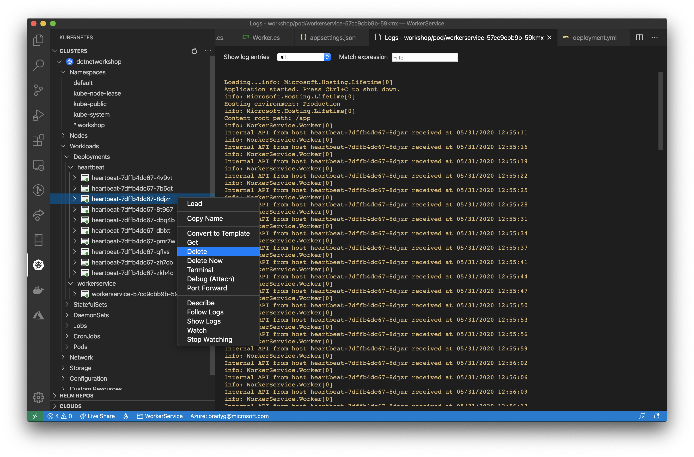

Now that the `heartbeat` and `workerservice` microservices are running in the cluster, we can wire the two up so that they can communicate with one another. The `workerservice` will need to make HTTP calls within the cluster to the `heartbeat` API service as its `ExecuteAsync` method fires.

Since the `heartbeat` API has been set up as a service, the Kubernetes internal DNS will handle all requests to `http://heartbeat` by routing the request to the most appropriate instance of the container.

Now, open the `WorkerService.csproj` file. You'll see the project references. The `Worker` class is going to need to create instances of the `HttpClient` class to make HTTP calls to the heartbeat API within the cluster. Rather than create new instances of the `HttpClient` manually in code, we'll use the `IHttpFactory` service to create them for us, as this approach is much safer.

```xml
<ItemGroup>
    <PackageReference Include="Microsoft.Extensions.Hosting" Version="3.1.2" />
</ItemGroup>
```

Add this `PackageReference` node to that `ItemGroup`.

```xml
<PackageReference Include="Microsoft.Extensions.Http" Version="3.1.4" />
```

Your resulting `ItemGroup` should look like this.

```xml
<ItemGroup>
    <PackageReference Include="Microsoft.Extensions.Hosting" Version="3.1.2" />
    <PackageReference Include="Microsoft.Extensions.Http" Version="3.1.4" />
</ItemGroup>
```

The .NET `HttpClient` class is relatively verbose in how it logs by default. You can "turn down the volume" on the `HttpClient`'s log verbosity by adding a line of code to the `appsettings.json` file that sets the log level of the `HttpClient`, specifically. The `WorkerService` project's `appsettings.config` probably looks something like this.

```json
{
  "Logging": {
    "LogLevel": {
      "Default": "Information",
      "Microsoft": "Warning",
      "Microsoft.Hosting.Lifetime": "Information"
    }
  }
}
```

You'll want to add a line of code to it to turn down the log level on the `HttpClient`. To do this, add one line of code to the `appsettings.json`:

```json
"System.Net.Http.HttpClient": "Warning"
```

Thus resulting in an `appsettings.json` file containing the following log configuration.

```json
{
  "Logging": {
    "LogLevel": {
      "Default": "Information",
      "Microsoft": "Warning",
      "Microsoft.Hosting.Lifetime": "Information",
      "System.Net.Http.HttpClient": "Warning"
    }
  }
}
```

Your `Program.cs` file's `CreateHostBuilder` method looks something like this, currently.

```csharp
public static IHostBuilder CreateHostBuilder(string[] args) =>
    Host.CreateDefaultBuilder(args)
        .ConfigureLogging(loggingBuilder => 
        {
            loggingBuilder.AddConsole(options => 
            {
                options.DisableColors = true;
            });
        })
        .ConfigureServices((hostContext, services) =>
        {
            services.AddHostedService<Worker>();
        });
```

Within the call to `ConfigureServices` you'll want to wire up the `IHttpClientFactory` service using the built-in middleware. To do this, add this line of code in the call to `ConfigureServices`:

```csharp
services.AddHttpClient();
```

The resulting `ConfigureServices` method should look like this:

```csharp
.ConfigureServices((hostContext, services) =>
{
    services.AddHttpClient();
    services.AddHostedService<Worker>();
});
```

Open up `Worker.cs`. Add two fields to the file.

```csharp
private readonly IHttpClientFactory _httpClientFactory;
private HttpClient _httpClient;
```

Change the constructor so that it sets the `_httpClientFactory` field:

```csharp
public Worker(ILogger<Worker> logger,
    IHttpClientFactory httpClientFactory)
{
    _logger = logger;
    _httpClientFactory = httpClientFactory;
}
```

The `Worker` class inherits from `BackgroundService`, which supplies the implementation to `IHostedService`. However, we'll override the two methods of `IHostedService` that are already implemented as abstract methods - `StartAsync` and `StopAsync`. In these methods we'll add code that handles construction and destruction of the `HttpClient` field, `_httpClient`, the `Worker` class will be using as the `ExecuteAsync` method fires.

Our last update to `Worker` will be to add code to the `ExecuteAsync` method so that the `Worker` begins calling the heartbeat API. Since Kubernetes' internal DNS routing will know how to find all of the instances of the heartbeat API via the simple `http://heartbeat/` URL, that's all we need in the `ExecuteAsync` method to be able to locate the API.

```csharp
protected override async Task ExecuteAsync(CancellationToken stoppingToken)
{
    while (!stoppingToken.IsCancellationRequested)
    {
        try
        {
            var json = await _httpClient.GetStringAsync("http://heartbeat/");
            var instanceInfo = JsonSerializer.Deserialize<InstanceInfo>(json);
            _logger.LogInformation($"Internal API from host {instanceInfo.HostName} received at {instanceInfo.HostTimeStamp}");
        }
        catch(Exception ex)
        {
            _logger.LogError(ex, "Error during HTTP request");
        }

        await Task.Delay(3000, stoppingToken);
    }
}
```

Now, rebuild the `WorkerService` project into a Docker container and push it to ACR. Then, delete the Worker instance running in the AKS cluster. When AKS pulls a new instance of the image from ACR and activates it in the cluster, following the logs shows that the `workerservice` in the AKS cluster is now calling the `heartbeat` service in the cluster successfully.



Notice that the `workerservice` is probably repetitively calling the same instance of the `heartbeat` service.


Find the instance that continually responds in the **Deployments** node in the Kubernetes cluster explorer in Visual Studio Code.

> Note: Don't delete the node from the **Services** node, delete it from the **Deployments** node.



Notice how the `workerservice` instance finds a new `heartbeat` service to start calling, immediately, as Kubernetes redirects the HTTP calls to a running instance and automatically replaces the one we just deleted.


Let's change the code in the `workerservice` so that we simuate more heavy load on the `heartbeat` service, and add a delay to the heartbeat API to simulate a longer response time.
